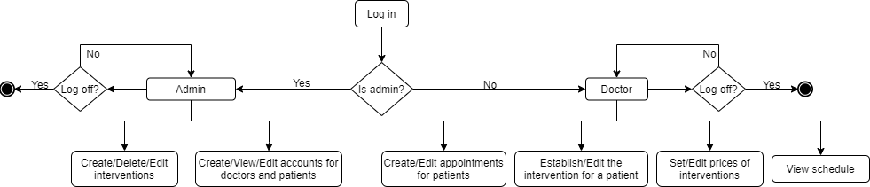

# ISW---Project

Nume disciplina: ISW - Inginerie Software

Nume proiect: Dental Office

Membrii: 
  Bădiță Alexandru-Cristian,
  Călin Cristina-Ioana,
  Ghiuzan Otilia-Roxana,
  Puia Andrea
    
Platforma de comunicare: Atlassian | Software Development and Collaboration Tools
   Link acces: https://cristinaioanacalin.atlassian.net/jira/software/projects/DEN/boards/3

Diagrama aplicatiei:

